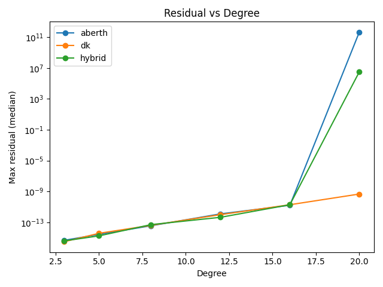

# geodepoly — Series-Reversion Polynomial Solver (MVP)

[About](ABOUT.md)

[](https://github.com/ricfulop/geodepoly/actions)
[](https://pypi.org/project/geodepoly/)
[](LICENSE)

`geodepoly` is a small Python package that finds all roots of a complex polynomial
using a **shift–recenter + truncated series reversion** with optional bootstrap
iterations, and only falls back to classical iterations when strictly necessary.

This implements the *impact-first MVP* discussed:
- Compositional inverse (via Lagrange inversion in coefficient form) around a local
  recentering point to obtain an analytic series for a nearby root.
- **Bootstrap:** update the center by the series estimate and re-expand (typically a few steps).
- **Deflation:** synthetic division to peel off roots one-by-one.
- Safe fallbacks: Halley or Durand–Kerner if series degenerates (multiple root / tiny derivative).

> Note: This is a *minimal working scaffold* you can publish and iterate on.
> It is self-contained (numpy optional), tested, and provides a SymPy hook.

## Install (editable)

```bash
pip install -e .
```

## Install (PyPI)

```bash
pip install geodepoly==0.1.4
```

## Quickstart

```python
from geodepoly import series_solve_all

# Coefficients lowest-degree first: a0 + a1 x + ... + aN x^N
coeffs = [1, 0, -7, 6]  # 1 + 0 x - 7 x^2 + 6 x^3 = 0  (roots near 1, 2, 3 after rescale)
roots = series_solve_all(coeffs, verbose=True)
print(roots)
```

## CLI

```bash
python -m geodepoly.scripts.benchmark --deg 8 --seed 123 --trials 100
```

### Examples

- SymPy comparison: `python examples/sympy_vs_nroots.py`
- JSON bridge round‑trip: `python examples/json_bridge_roundtrip.py`
- Multiple root demo: `python examples/multiple_root_demo.py`

## API

- `series_solve_all(coeffs, max_order=32, boots=3, tol=1e-12, max_deflation=None, verbose=False)`
- `series_one_root(coeffs, center=None, max_order=32, boots=3, tol=1e-14)`
- `sympy_solve(poly)` — lightweight SymPy integration (if SymPy is installed).
- `solve_eigs(A)` — eigenvalues via characteristic polynomial (Faddeev–LeVerrier).

## How it works (short)

Let `p(x)` be a degree-`n` polynomial. We recenter around `x = μ` and expand
`q(y) = p(μ + y) = a0 + a1 y + a2 y^2 + ...`. If `a1 ≠ 0`, solve `q(y)=0` by
compositional inversion of `F(y) = y + β2 y^2 + β3 y^3 + ...` with `βk = ak/a1`.
Lagrange inversion gives the inverse coefficients `{g_m}` of `F`, and the nearby
root is `y ≈ Σ_{m≥1} g_m t^m`, with `t = -a0/a1`. Update `μ ← μ + y` (bootstrap)
and repeat a few times; then deflate and continue.

This repo implements the coefficient formula
`g_m = (1/m) * [y^{m-1}] (1 / F'(y))^m` using truncated series arithmetic.
No derivatives of `p` beyond `a1 = q'(0)` are used.

## Caveats

- Multiple or nearly-multiple roots are ill-conditioned for *any* method.
  We switch to a guarded Durand–Kerner step when `|a1|` is tiny.
- Convergence radius depends on the local analytic structure; bootstrap helps.

## License

MIT

---

## New in this build

### Friendlier API
```python
from geodepoly import solve_poly, solve_all, solve_one
roots = solve_poly(coeffs, method="hybrid", resum="pade")
```

**Methods:** `hybrid` (series seeds + Aberth), `aberth`, `dk`, `numpy` (companion).  
**Resummation:** `None`, `"pade"`, `"borel"`, `"borel-pade"`.

### SymPy integration
```python
from geodepoly.sympy_plugin import sympy_solve
roots = sympy_solve(x**8 - 3*x + 1, method="hybrid", resum="pade")
```

### Mathematica / Maple bridge (JSON CLI)
```bash
python bridges/geodepoly_cli.py <<'JSON'
{"coeffs":[-6,11,-6,1],"kwargs":{"method":"hybrid","resum":"pade"}}
JSON
```
In Mathematica:
```wl
payload = ExportString[<|"coeffs"->{-6,11,-6,1},"kwargs"-><|"method"->"hybrid","resum"->"pade"|>|>,"JSON"];
res = RunProcess[{"python","bridges/geodepoly_cli.py"}, "StandardInput"->payload, "StandardOutput"];
ImportString[res, "JSON"]
```

### Benchmarks
```bash
python -m geodepoly.scripts.bench_compare --deg 8 --trials 50 --out bench_deg8.csv
```

Aggregate and plot (see `docs/assets/`):
```bash
python scripts/bench_compare.py --degrees 3,5,8,12 --methods hybrid,aberth,dk --trials 10 --out docs/assets/bench.csv --agg_out docs/assets/bench_agg.csv --resum auto
python scripts/plot_bench.py --in docs/assets/bench_agg.csv --out docs/assets
```

Previews:




### Paper skeleton
See `paper/GeodePoly_MVP.md`.

## Bench dataset & GPU roadmap

- GeodeBench spec: `bench/geodebench_spec.md`, generator: `bench/generate_slices.py`
- GPU roadmap: `docs/geode_gpu_spec.md`

## Hyper-Catalan API (S[t2,t3,...])

Utilities based on the paper's multivariate series:

```python
from geodepoly import evaluate_hyper_catalan, evaluate_quadratic_slice, catalan_number

# Quadratic slice (Catalan series)
t2 = 0.05
alpha_approx = evaluate_quadratic_slice(t2, max_weight=20)
catalan_series = sum(catalan_number(n) * (t2**n) for n in range(12))

# Multivariate evaluation (truncated by weighted degree)
alpha_multi = evaluate_hyper_catalan({2: 0.05, 3: 0.01}, max_weight=12)
```

See `docs/paper_guide.md` for how the paper maps onto the codebase.
