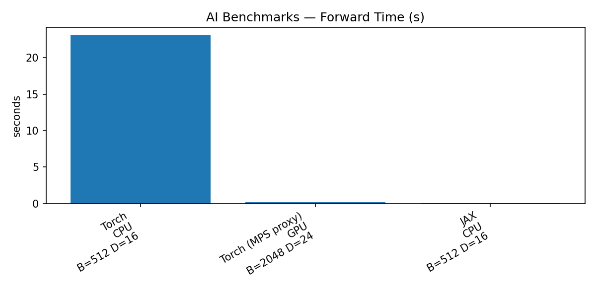
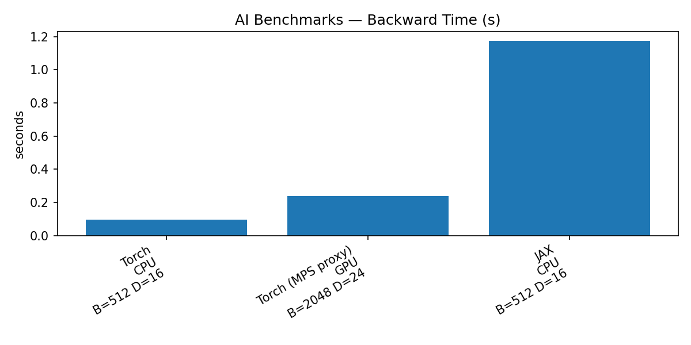

# AI Benchmarks

This page shows how to run AI-oriented benchmarks for the differentiable RootLayer paths.

## Torch (CPU/CUDA)

```bash
python scripts/bench_ai_torch.py --batch 512 --degree 16 --device cpu
# GPU (if available)
python scripts/bench_ai_torch.py --batch 2048 --degree 24 --device cuda
```

## JAX (CPU/GPU/TPU)

```bash
python scripts/bench_ai_jax.py --batch 512 --degree 16
```

Both scripts report forward and backward times. Adjust batch/degree based on memory.

Note (Apple Silicon / MPS): Torch on MPS does not currently support complex dtypes. Our MPS row below uses a
proxy workload (batched polynomial evaluation plus several Newton steps with real tensors) to provide a
GPU-like reference on Mac. CUDA results (true complex path) should be collected on an NVIDIA GPU host or
Colab GPU.

## Results (placeholders)

| Backend | Device | Batch | Degree | Forward (s) | Backward (s) |
| --- | --- | --- | --- | --- | --- |
| Torch | CPU | 512 | 16 | 23.0536 | 0.0951 |
| Torch (MPS proxy) | GPU | 2048 | 24 | 0.1882 | 0.2390 |
| JAX | CPU | 512 | 16 | 0.0304 | 1.1731 |
| JAX | GPU | 4096 | 24 | tbd | tbd |

To reproduce: use the commands above. Submit PRs to update these rows with your hardware.

### Plotting

Save your results to a CSV (headers: `Backend,Device,Batch,Degree,Forward,Backward`) and run:

```bash
python scripts/plot_ai_bench.py --csv docs/assets/ai_bench.csv --out docs/assets
```

This generates `ai_bench_forward.png` and `ai_bench_backward.png` in `docs/assets/`.

### Plots




