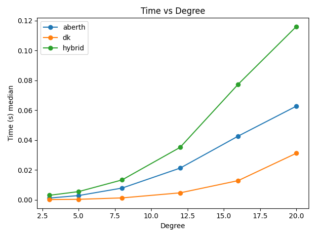

# Benchmarks

- Run: `python scripts/bench_compare.py --degrees 3,5,8,12 --methods hybrid,aberth,dk --trials 10 --out docs/assets/bench.csv --agg_out docs/assets/bench_agg.csv`
- Plot: `python scripts/plot_bench.py --in docs/assets/bench_agg.csv --out docs/assets`

## Newton vs hybrid (tuned)

Summary (medians over 5 trials):

| degree | method | time_median(s) | res_median |
| --- | --- | ---: | ---: |
| 3 | hybrid | 0.0027 | 2.48e-16 |
| 3 | newton | 0.0000 | 3.33e-16 |
| 5 | hybrid | 0.0060 | 2.22e-15 |
| 5 | newton | 0.0000 | 1.89e-15 |
| 8 | hybrid | 0.0142 | 1.22e-14 |
| 8 | newton | 0.0001 | 8.30e-15 |
| 12 | hybrid | 0.0314 | 6.17e-13 |
| 12 | newton | 0.0003 | 6.17e-13 |
| 16 | hybrid | 0.0796 | 5.60e-11 |
| 16 | newton | 0.0017 | 2.70e-11 |
| 20 | hybrid | 0.1191 | 1.91e-10 |
| 20 | newton | 0.0027 | 3.19e-10 |

CSV: `docs/assets/newton_vs_hybrid_tuned.csv`
